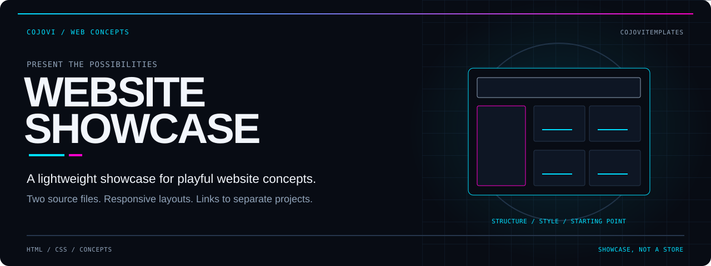
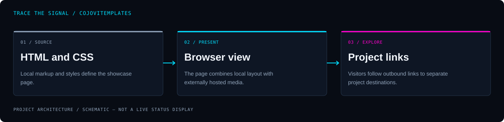

<!-- COJOVI / SIGNAL — CojoviTemplates project edition. Keep with readme-assets/. -->
<a name="top"></a>

<p align="center">
  
</p>

<h1 align="center">CojoviTemplates</h1>

<p align="center">
  <strong>Put the concepts on display. Make the next project your own.</strong><br>
  A static portfolio landing page presenting website ideas through project links and satirical sample copy.
</p>

<p align="center">
  
</p>

<p align="center">
  <a href="#overview">Overview</a> ·
  <a href="#architecture">Architecture</a> ·
  <a href="#quickstart">Quickstart</a> ·
  <a href="#configuration">Customize</a> ·
  <a href="#validation">Validation</a> ·
  <a href="#security">Boundaries</a>
</p>

---

<a name="overview"></a>
## `> meet_the_showcase`

**CojoviTemplates is a two-file HTML/CSS showcase—not a bundle of the linked applications.** It introduces Cojovi's custom website concepts, pairs feature descriptions with externally hosted imagery, and points visitors toward separate projects and the wider portfolio.

The page includes a hero, a logo strip, project feature blocks, a satirical testimonial section, a contact call to action, and a footer. The source describes the content as placeholder material intended for repurposing.

| Present | Adapt | Keep it simple |
| :--- | :--- | :--- |
| Feature website concepts with text, images, and outbound links. | Edit page content directly and adjust shared CSS variables. | One HTML entrypoint and one stylesheet; no package install or build step. |

> [!IMPORTANT]
> **Project descriptions are not local functionality.** Checkout, customer accounts, subscriptions, email signup, blog storage, and an interactive terminal are described in the showcase, but their implementations are not in this repository. Linked sites are separate and were not verified by this audit.

<a name="architecture"></a>
## `> trace_the_page`

<p align="center">
  
</p>

```text
index.html + style.css
          ↓
Browser-rendered showcase
  ├─ remote images, font, and list icon
  └─ project / portfolio links
          ↓
Separate external destinations
```

[index.html](index.html) holds all page content and links. [style.css](style.css) supplies design tokens, layout utilities, section styling, and responsive rules. There is no JavaScript, backend, database, or form handler in the tracked source.

**The page is not fully self-contained.** It requests Google Fonts, external images, and a Cloudinary-hosted check icon. The layout remains local, but remote resources require network access and may change independently.

<a name="quickstart"></a>
## `> open_the_showcase`

**Prerequisites:** Git and a browser. Python 3 is optional for a local HTTP preview; Node.js and npm are not required.

### 1. Get the source

```bash
git clone --depth 1 https://github.com/cojovi/CojoviTemplates.git
cd CojoviTemplates
```

Open `index.html` in your browser for a direct file preview. Keep `style.css` beside it so the relative stylesheet link resolves.

### 2. Optional local HTTP preview

From the repository directory:

```bash
python3 -m http.server 8000 --bind 127.0.0.1
```

Open **[http://localhost:8000](http://localhost:8000)**. Stop the preview with **Ctrl+C**. This is a loopback development server, not a production-hosting recommendation; it serves files from the current directory.

### 3. Prepare a static deployment

After reviewing the [acceptance checklist](#validation), place `index.html` and `style.css` together on a static host. No generated build directory or application server is specified by this repository. External media is not bundled with those files.

<a name="configuration"></a>
## `> make_it_yours`

There are **no environment variables, configuration files, or API keys** required by the supplied page. All customization is direct source editing.

| Change | Where to edit |
| :--- | :--- |
| Intro, project descriptions, and calls to action | Section markup in [index.html](index.html). |
| Project destinations and portfolio links | Anchor `href` values in [index.html](index.html). |
| Images and accessible descriptions | Image URLs and `alt` attributes in [index.html](index.html). |
| Page title, canonical URL, and social previews | The document's `<head>` in [index.html](index.html). |
| Color, typography, spacing, and radii | `:root` custom properties in [style.css](style.css). |
| Grid behavior and responsive layouts | Media-query sections in [style.css](style.css). |

### A practical customization order

1. Replace the introduction and project descriptions with accurate content.
2. Supply images you are authorized to use; host them yourself if independence from third parties matters.
3. Replace the satire and fictional endorsements with clearly labeled examples or genuine, permissioned testimonials.
4. Set each destination deliberately, including contact and footer navigation.
5. Align the canonical URL, social metadata, page title, favicon, and preview image with the actual deployment.
6. Tune the shared CSS tokens, then check each responsive layout.

The stylesheet uses CSS Grid and Flexbox, with media-query breakpoints at `48rem`, `64rem`, and `75rem`. Its default typeface is Inter, loaded externally with a sans-serif fallback.

<a name="usage"></a>
## `> browse_the_concepts`

The feature blocks introduce these concepts in the page copy:

| Concept | Presentation in this repository |
| :--- | :--- |
| CojoviSport Footwear | A footwear-site description with an outbound project link. |
| Bowsers Bud | A store concept described with placeholder marketing copy. |
| CojoClaw | A beverage-site concept with a separate destination. |
| Stargazer | A command-prompt-style project described and linked externally. |

These entries are curated HTML, not a data-driven catalog, downloadable template registry, or multi-site generator. To add another entry, adapt a feature block and its layout classes; the repository provides no scaffolding command.

<a name="validation"></a>
## `> check_before_share`

**Builds and tests were not run for this documentation-only task.** There is no package manifest, build script, automated test suite, or CI workflow in the audited source tree.

Before using the page publicly:

- [ ] Validate the HTML and review the feature-section nesting.
- [ ] Remove the duplicate title and description metadata; choose one coherent set.
- [ ] Set the canonical and social URLs to the intended site.
- [ ] Replace the placeholder favicon and `#` navigation destinations.
- [ ] Fix the contact CTA: its current email-shaped `href` has no `mailto:` scheme and is interpreted as a relative path.
- [ ] Replace `alt="#"` and `aria-label="#"` values with useful text or appropriate decorative treatment.
- [ ] Check focus visibility, keyboard navigation, and text contrast.
- [ ] Preview narrow, tablet, and desktop layouts.
- [ ] Confirm authorized images, fonts, and icons load from the intended hosts.
- [ ] Review external destinations before relying on their functionality.
- [ ] Make placeholder copy and fictional testimonials unambiguous.

These are source-review findings and checks to perform—not claims of a passing browser or accessibility test.

<a name="source-map"></a>
## `> explore_the_source`

| File | What it owns |
| :--- | :--- |
| [index.html](index.html) | Metadata, page structure, copy, image references, and all links. |
| [style.css](style.css) | Theme variables, foundational styles, components, sections, and media queries. |

The audited source revision contains only those two files. There are no local image assets, application subprojects, dependency lockfiles, or agent instruction files in that revision.

<a name="security"></a>
## `> draw_the_boundary`

**Static does not mean disconnected.** Remote fonts, images, and icons make browser requests to other services; external project links leave this page. Review privacy, availability, and asset permissions before deployment. Do not place credentials or private information into public HTML or CSS.

The testimonial area is satirical placeholder material, **not verified endorsements**. Likewise, product and service descriptions are sample copy, not evidence for commercial or health claims. Replace or clearly label them before adapting the page for a real business.

### Attribution and license

The source credits **cojovi** and includes a **2024 cojovi.com** copyright notice. Preserve those notices and any applicable third-party attribution when working with the source.

**No repository license file was found at the audited revision.** The page's invitation to repurpose designs does not supply formal code or asset license terms. Confirm permission for your intended use; do not assume the remotely hosted media is included in a reuse grant.

---

<p align="center">
  
</p>

<p align="center">
  <strong>Simple source. Playful concepts. Deliberate reuse.</strong><br>
  <sub>A <a href="https://github.com/cojovi">Cody / cojovi</a> project · <a href="https://cojovi.com">cojovi.com</a><br>
  CojoviTemplates · Presented in COJOVI / SIGNAL.</sub>
</p>

<p align="center"><a href="#top">↑ Back to the signal</a></p>
